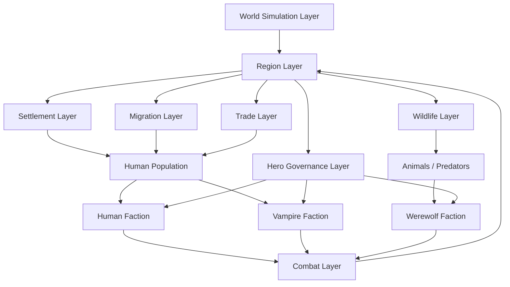
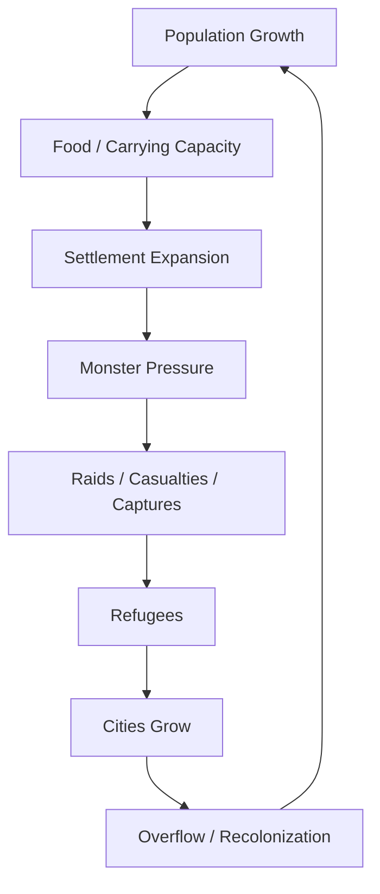
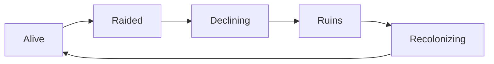
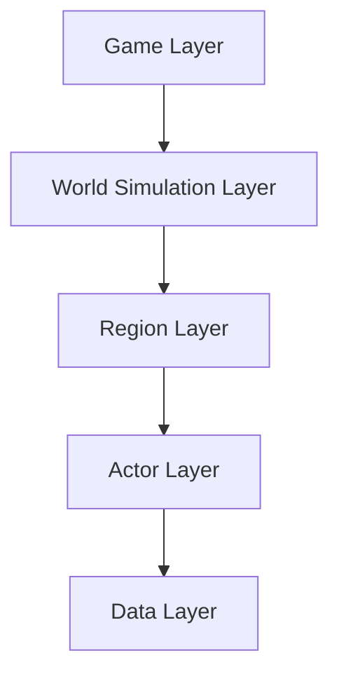

# RTS AI Game Dev Dashboard

מסמך זה מרכז את כל מערכות המשחק, את יחסי הגומלין ביניהן, ואת סדר החשיבה לפיתוח.

---

# 1. High-Level System Map

---

# 2. Core World Layers

## World Simulation Layer
**Main class:** `URTSWorldSubsystem`

Responsible for:
- population growth
- wildlife growth
- threat decay
- migration
- settlement collapse
- recolonization

Pulse interval:
- every 120–300 seconds

## Region Layer
**Main class:** `ARTSRegionVolume`

Core state:
- OwnerFaction
- ControlLevel
- Population
- FoodCapacity
- WildlifeCount
- ThreatLevel
- GarrisonPower
- SettlementState

## Settlement Layer
**Main actor:** `ARTSSettlement / BP_Settlement`

Types:
- Capital
- City
- Town
- Village
- Hamlet

## Population Layer
**Main actor:** `ARTSHumanNPC`

States:
- Idle
- Working
- Fleeing
- Captured

## Wildlife Layer
**Main actor:** `ARTSAnimal`

Types:
- Deer
- Boar
- Wolf
- Bear

## Migration Layer
**Main actor:** `ARTSRefugeeGroup`

## Trade Layer
**Main actor:** `ARTSCaravan`

## Hero Governance Layer
Built on:
- `ARTSHeroCharacter`
- `URTSCommandAuthorityComponent`
- `URTSSecureRegionComponent`

---

# 3. Faction Dashboard

## Humans
### Strategic Identity
- defend settlements
- stabilize regions
- protect food and trade
- use population as military base

### Economy Inputs
- population
- food
- caravans
- safe regions

### Region Priorities
- capital
- cities
- farm belts
- trade roads

## Vampires
### Strategic Identity
- feed on dense human clusters
- exploit refugee flows
- ambush caravans
- prefer controlled extraction over total destruction

### Economy Inputs
- captured humans
- urban density
- caravan interception

### Region Priorities
- cities
- trade nodes
- refugee routes

## Werewolves
### Strategic Identity
- dominate wilderness
- hunt animals
- raid exposed frontier settlements
- leverage predator economy

### Economy Inputs
- wildlife
- captured humans
- predator domestication

### Region Priorities
- forests
- frontier villages
- ruined lands
- trade ambush zones

---

# 4. Economy Dashboard

## Main Strategic Resources
- Population
- Food
- Wildlife
- Control
- Threat

## Core Economy Loop

## Settlement Lifecycle

---

# 5. Campaign Dashboard

## Region Variables
Each region should expose:

- OwnerFaction
- ControlLevel
- Stability
- Population
- FoodCapacity
- WildlifeCount
- ThreatLevel
- GarrisonPower
- SettlementState
- BorderPressure
- RefugeePressure

## Hero Actions
- SecureRegion
- RaiseMilitia
- FortifySettlement
- SuppressRevolt
- HuntMonsters
- ClaimRuins
- EscortCaravan

## Region Events
- Raid
- RefugeeWave
- SettlementCollapse
- Recolonization
- WildlifeMigration
- CaravanAmbush
- BorderCrisis

---

# 6. Technical Dashboard

## Architecture Layers

## Main C++ Classes
- `ARTSGameModeBase`
- `ARTSPlayerController`
- `ARTSCameraPawn`
- `ARTSUnitCharacter`
- `ARTSHeroCharacter`
- `ARTSRegionVolume`
- `URTSWorldSubsystem`
- `ARTSSettlement`
- `ARTSHumanNPC`
- `ARTSAnimal`
- `ARTSRefugeeGroup`
- `ARTSCaravan`

## Main Data Assets / Tables
- `DT_RegionTypes`
- `DT_SettlementTypes`
- `DT_HumanUnits`
- `DT_MonsterUnits`
- `DT_WildlifeTypes`
- `DT_FarmTypes`
- `DT_CaravanTypes`
- `DT_EcologyRules`

---

# 7. Performance Dashboard

## Target Simulation Scale
- ~1000 simulated humans
- ~200 simulated animals
- 20–30 strategic regions

## Active Runtime Budget
- 60–120 active humans near player
- 40–80 active animals
- up to 200 combat units

## Performance Principles
- simulate far regions abstractly
- spawn actors only in loaded regions
- avoid heavy Tick logic
- use World Partition safely
- reconstruct actors from region state

---

# 8. Production Dashboard

## Implementation Order
1. Region simulation
2. Settlement system
3. Human population actors
4. Wildlife ecosystem
5. Refugee migration
6. Caravan trade
7. Collapse / recolonization
8. Campaign layer hero actions

## AI / Cursor Rules
- preserve systems already in project
- extend instead of rewrite
- prefer C++ for simulation
- use Blueprints for world actors and visuals
- keep balance data in DataTables

---

# 9. Quick Decision Matrix

| Topic | MVP Decision |
|---|---|
| Base building | No classic base building |
| Economy core | Population + regions + ecology |
| Human resource model | Physical NPC humans |
| Werewolf fallback economy | Hunt animals |
| Vampire core targets | Cities, caravans, refugees |
| Region recovery | Yes |
| Settlement destruction | Yes |
| Recolonization | Yes |
| Continuous campaign | Yes |
| Separate campaign map | No |

---

# 10. One-Sentence Project Identity

**A continuous campaign RTS where heroes command armies across a living world of regions, population, ecology, fear, and territorial collapse.**
